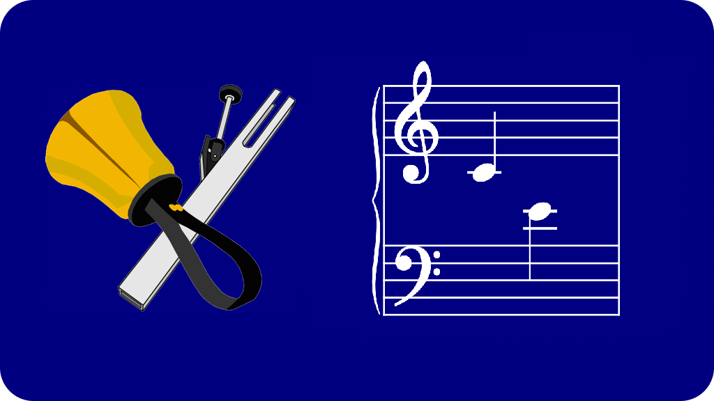

# Handbell Notation Plugins

A collection of plugins to assist with writing music for handbells and handchimes
in MuseScore Studio.

## Installation

Click the green "&lt;&gt; Code" button and click "Download Zip", unzip it, and
move the "handbell-notation" folder inside your Plugins folder.  This is normally
in your Documents folder under MuseScore3 or MuseScore4.

Then, in MuseScore, choose "Manage Plugins…" or "Plugin Manager…" from the Plugins
manager.  In MuseScore 3, check the boxes next to the plugins you want to enable.
In MuseScore 4, select each plugin and click the "Enable" button in the bottom
right corner.

There should now be a submenu under the Plugins menu called "Composing/arranging
tools" in MuseScore 4, or "Handbell Notation" in MuseScore 3.  You must have a
score open to use these plugins.

## Usage

### Find Handbells On the Wrong Staff

Analyzes all notes within the current selection, or the whole score if nothing
is selected, and identifies any notes written on C5 or below in the treble
clef or D5 and above in the bass clef.  All bad notes are marked in bright
green, and a report is presented with a list of the bad notes found.

Sharps and flats are ignored, so C♯5 is expected to be in bass clef and D♭5
is expected to be in treble clef, even though these are enharmonically
equivalent.

### Get Handbells Used

Analyzes all notes within the current selection, or the whole score if nothing
is selected, and produces a list of handbells and handchimes used.

Does not insert an actual Handbells Used chart at the beginning of your score.
I may explore the feasibility of doing so in a future version, but for now it
just gives you a list as text.

Unfortunately there is currently no way to copy the text out of this window.
You can take a screen shot if you want, but you can't copy the text to paste
it into something else.  Also, you'll have to use the mouse to close the window;
the normal keyboard shortcut to close a window (⌘W on Mac, Ctrl-W on
Windows/Linux) does not close the Handbells Used window, and will instead try to
close your score.

Be careful to select the complete range you want to analyze (or make sure nothing
is selected).  If you have a bells used chart at the beginning of your score, you
should exclude it from your selection.

#### Handbells vs. Handchimes

Notes with normal note heads are assumed to be handbells.  Notes with diamond
note heads are assumed to be handchimes.  Notes with any other note heads will be
listed as "Unknown".  These are each listed separately, as you'd expect.

#### Accidentals and Enharmonics

If notes with the same pitch are written in more than one way in your score
(e.g. D♯ and E♭), both names will be grouped together in parentheses.

#### Octaves

Handbells are a transposing instrument; they sound one octave higher than written,
so a note written as C4 (middle-C) will sound like C5, and should be listed as C5.
In MuseScore 4.x, the "Hand Bells" instrument is set up this way by default, but
in MuseScore 3.x it isn't.  And some of us prefer to use the "Piano" instrument
for writing handbell music, which is also non-transposing.  The plugin tries to
do the right thing in all cases, which is to go by one octave higher than the
written pitch on the staff, regardless of the instrument used or the transposition
settings.  Due to some bizarre limitations of MuseScore's plugin API, figuring this
out is is really complicated and it could break in very strange ways if you're
doing something weird, but so far it works correctly in my testing.

### Set Selected Notes to Handbells

   

Changes all selected notes to use standard note heads, and sets the color to black.
This is intended for changing handchime notes to handbells.

Dots and accidentals belonging to the selected notes will also be updated, but
stems, hooks and beams will only be updated if they are included in the selection.
They will be included if you select a range, but not if you select only individual
note heads.  Rests and other elements, even if selected, will be ignored.

If any of the selected notes use some note head other than standard or diamond,
you'll get an error; fix these manually, or exclude them from your selection.

If nothing is selected, you'll get an error.

### Set Selected Notes to Handchimes

Changes all selected notes to use diamond note heads, and sets the color to red
(if you want).  This is intended for changing handbell notes to handchimes.

The first time you use the plugin in a particular score, you will be asked to
choose your preferred color.  Bright red is best for printing (it looks different
on paper) but can be hard to look at on a screen, so you can also choose a darker
red if you prefer, or choose black if you won't be printing in color.  Your choice
is saved as a custom field called "handchimeColor" in Project Properties (or
Score Properties in MuseScore 3), so if you change your mind later, you can edit
the hex value there or simply delete the field if you want to be asked again.

Dots and accidentals belonging to the selected notes will also be updated, but
stems, hooks and beams will only be updated if they are included in the selection.
They will be included if you select a range, but not if you select only individual
note heads.  Rests and other elements, even if selected, will be ignored.

If any of the selected notes use some note head other than standard or diamond,
you'll get an error; fix these manually, or exclude them from your selection.

If nothing is selected, all existing handchime notes in the score will have their
color updated to match your preference, without changing any note heads.  When
doing this, stems and beams will also be updated, but only if all notes that share
the stem or beam are handchimes.

## Version compatibility

These plugins are intended to work with both MuseScore 3.x and MuseScore 4.x on
Windows, Mac and Linux, but have only been tested in 3.6.2 and 4.4 on Mac.
As with most plugins, it is very likely that they will break in a future version
of MuseScore, and will need to be rewritten.

Known differences between versions:
- In MuseScore 3.x, all plugins will appear under a "Handbell Notation" submenu
under the Plugins menu.  In MuseScore 4.x, they appear under "Composing/arranging tools"
(which may be shared by other unrelated plugins).
- Graphics are not used by MuseScore 3.x.
- In MuseScore 3.x, the "Hand Bells" instrument is assumed to be non-transposing,
just like "Piano".  In MuseScore 4.x, the "Hand Bells" instrument is assumed to be
transposing by one octave.  These are the default settings in each version.  However,
in both versions we also try to verify this by checking the vertical position of the
note on the staff, and adjusting as needed.
- The "Find Handbells On the Wrong Staff" plugin implements a workaround for a bug
in MuseScore 3 which caused `curScore.staves` to fail.  The bug was fixed in
MuseScore 4.

## Artwork
Handbell artwork © 2007-2012 Tena Luben, A Familiar Ring  
<https://www.afamiliarring.com/handbell-pictures.htm>
